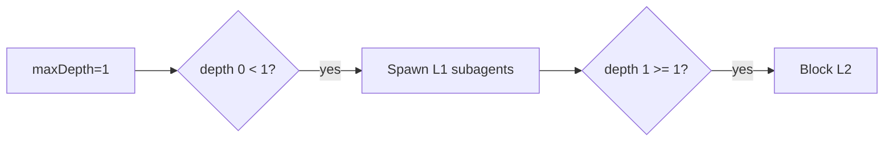

# Agent / Harness Infrastructure Improvements

> **Status:** updated 2026-07-13. The subagent batch/chain orchestration described in older audit sections below has been removed. One tool call now delegates one task; pi's native sibling tool calls provide parallelism and normal turns provide sequencing. Per maintainer preference, this favors **off-the-shelf harness behavior over bespoke orchestration**.

Scope: improving agent *outcomes/performance* and *provider reliability* for the pie stack — the VS Code extension, pi extensions, system prompts, skills, and the umans provider wiring. Four problem areas surfaced from a workspace scan:

1. **Subagent rate-limit storms** — the dominant user-visible pain.
2. **Umans provider strictness** — stricter session limits with no queue / retry backpressure.
3. **Subagent limits being ignored** — the throughput governor that is actually missing.
4. **Prompt / harness hygiene** — instructions that actively encourage fan-out.

---

## 1. Subagent fan-out causes the rate-limit storm

### What's actually happening

The user symptom — *"nesting set to 1 depth max, meaning no nesting, however it keeps happening, resulting in 10+ sub agent calls at once, instantly getting my account rate limited"* — is **not** a depth-enforcement failure. Depth **is** enforced (`extensions/subagent/src/execute.ts`: `if (runtimeCtx.depth >= maxDepth) return depthLimitResponse(...)`). The storm is **horizontal fan-out at one depth level**:

The original failure combined native sibling calls with an additional `tasks[]` fan-out layer and per-batch concurrency. The current design has one route only:

- A model reply may emit **multiple sibling `subagent` calls** for independent work.
- Every call has `{ agent, task, cwd?, bucket?, thinkingLevel? }`; `tasks[]`, `chain`, the per-call session counter, and the per-batch worker pool are gone.
- `PIE_SUBAGENT_MAX_INFLIGHT` caps active root trees process-wide and also bounds sibling calls emitted in one agent turn.
- Each root holds its permit for the complete tree lifetime. Nested descendants borrow that scope, preventing recursive permit deadlock.
- `DEFAULT_MAX_DEPTH = 3` and the tree-wide session budget defaults to 10.

This leaves one admission-control path rather than several partially coordinated limits.

### Why "max depth = 1" didn't help

`subagentMaxDepth` is a **confusingly-labelled "levels allowed"** slider, not a "depth of nesting" slider:



`maxDepth = 1` means "main → L1 is allowed." As of the item-3 fix, `0 = disabled` **is** supported: `validateOptionalInt` in `rpc.ts` clamps to `[0, 8]` and `execute()` short-circuits with `subagentsDisabledResponse` when `maxDepth === 0`. The UI slider still labels "1 level / 2 levels…"; relabelling to "Off / 1 level / …" is the remaining cosmetic piece.

### Recommendation — concrete code changes

**a. Expose a real "disabled" mode and relabel the slider.** ✅ Shipped (lower bound `0`, short-circuit at `maxDepth === 0`). Remaining: relabel the slider "Off / 1 level / …" (`extension/src/webview/panel/composer/settings-menu-subagent.tsx`).

**b. Use one throughput cap.** ✅ Shipped — obsolete `subagentMaxParallelTasks` and `subagentMaxConcurrency` preferences were removed with the batch route. `subagentMaxInflight` / `PIE_SUBAGENT_MAX_INFLIGHT` is now the single root-tree and per-turn sibling-call cap.

---

## 2. Umans provider — proxy for wiring + backpressure

> ### ✅ Implemented (2026-07-02)
> LiteLLM proxy is live in `pie/proxy/`. What shipped:
> - **Scaffold** — `proxy/` (`litellm_config.yaml` with 8 umans model routes, each `litellm_params.max_parallel_requests:4` and a shared `model_info.id: umans-shared` so all variants share one 4-slot queue; `pyproject.toml`; `.env.example`), run via `uv run litellm`.
> - **Control script** — `scripts/proxy.mjs` (`run`/`start`/`stop`/`health`); npm scripts in root `package.json`.
> - **Extension spawn** — `ProxyService` (`extension/src/host/backend/proxy-service.ts`) spawns + health-checks the proxy; `startup.ts` starts it before the backend (fail-loud: NoticeShown, no silent fallback, `UMANS_API_KEY`-present guard). Kill-tree fix (`taskkill /T /F` / process-group kill) prevents the uv→litellm grandchild orphan. The proxy `master_key` is `os.environ/UMANS_API_KEY` so it agrees with pi's auth.json key (LiteLLM is DB-less — a mismatch 400s with "No connected db").
> - **Routing** — `models.json` umans `baseUrl` → `http://localhost:4000/v1`, `apiKey` → `$UMANS_API_KEY` (equals the proxy `master_key`, which is `os.environ/UMANS_API_KEY` — DB-less LiteLLM requires the Authorization to match). Copilot + Ollama stay direct.
> - **Settings** — `pie.useProxy` (default true), `pie.proxyPort` (default 4000).
> - **Verified** — proxy boots, `/health/liveness`→200, real chat completion routed to umans upstream successfully. Extension typecheck + build synced to `~/.vscode/extensions/pie.pie-0.3.0`. *(Remaining: user reloads window to confirm the extension-spawn path.)*
>
> See `proxy/README.md` for operations. Items 2, 3, 5 have since shipped too; only item 4's adaptive `providerBusy` portion remains — see §4.

### Current state

`models.json` defines umans as a passthrough OpenAI-compatible provider:

```json
"umans": {
  "baseUrl": "https://api.code.umans.ai/v1",
  "api": "openai-completions",
  "apiKey": "$UMANS_API_KEY",
  "compat": { "supportsReasoningEffort": true }
}
```

`settings.json` has a top-level `retry` block (`maxRetries: 6`, `baseDelayMs: 3000`, `provider.maxRetryDelayMs: 60000`) — but this is the **pi runtime's own per-request retry**, applied per request in isolation. There is no process-wide admission control: nothing throttles *concurrent* in-flight requests, nothing honours `Retry-After`, nothing queues.

**The therapeutic gap:** when umans 429s one request, the others already in flight keep hammering, each independently retrying with its own backoff — a burst becomes sustained overload and the user is forced to rotate keys.

### Recommendation — use a local LLM gateway proxy (off-the-shelf)

This is the "proxy for wiring up agents with different providers" the maintainer noted is standard practice. The point is to put a single backpressure-aware hop between pie and every provider, rather than building queue/retry logic inside the extension. Two strong, self-hostable, open-source options:

**Option 1 — [LiteLLM Proxy](https://docs.litellm.ai/docs/proxy/quick_start)** *(recommended)*
- One binary / Docker container, OpenAI-compatible endpoint.
- **Per-key / per-model RPM + TPM limits** with a built-in queue and `Retry-After`-aware backoff. LiteLLM is explicitly designed for "many agents hammering one key" — exactly the umans storm.
- Built-in fallback chains (umans primary → openrouter / copilot failover), cost + token + error telemetry, virtual keys for sub-service isolation.
- Routing pie through it is one line in `models.json`:
  ```json
  "umans": { "baseUrl": "http://localhost:4000/v1", "api": "openai-completions", "apiKey": "$UMANS_API_KEY", ... }
  ```
  …plus a `litellm_config.yaml` declaring `umans` as an upstream with `rpm:` / `tpm:` matching the real account limit. Nothing else in pie changes — it already speaks OpenAI-completions.
- Handles the **stricter session limits** the user mentioned: set `rpm:` to just under the quota so a burst queues instead of 429-ing.

**Option 2 — [Portkey Gateway](https://github.com/Portkey-AI/gateway)**
- Same shape (OpenAI-compatible gateway, concurrency controls, retries-with-backoff, `Retry-After` respect, fallbacks).
- The repo already references Portkey price snapshots in `docs/internal/model-token-pricing-sources.md`, so it's a known quantity here.
- Slightly lighter if you only want gateway semantics and don't need LiteLLM's full admin UI / virtual-key system.

**Why a proxy beats building it in pie:** retry/backoff *only* works if it is centralised. Per-request retry in pi, plus per-call concurrency limits in the subagent extension, plus host-level throttling, all reinvent the same wheel at different layers and still don't coordinate across the process boundary. A local gateway is the single chokepoint that makes "rotate API keys" unnecessary: when the limit is hit, requests *queue* and resume as the window slides, instead of 429-ing and failing the agent turn.

**When to skip the proxy:** if you only ever run one pie instance, a single user, one provider, and one model at a time, the in-process semaphore (§1b) is enough. The moment you have subagent fan-out (which is most turns), multi-provider fallback, or want cost telemetry without writing it, LiteLLM wins.

---

## 3. Subagent limits being "ignored" — the missing governor

The phrase in the request — *"the app does not respect sub agent limits … 10+ sub agent calls at once"* — maps precisely to the gap between the two existing limit families:

| Limit | Where enforced | Stops the "10+ at once" storm? |
|---|---|---|
| `subagentMaxDepth` | `extensions/subagent/src/execute.ts` | **No** — caps vertical nesting, not horizontal fan-out |
| `subagentMaxTreeSessions` (10 default) | `runner.ts` `consumeTreeSlot` | Bounds total recursive cost per tree |
| `subagentMaxInflight` (2 default) | `concurrency-limit.ts` + `runner.ts` | Caps active root trees process-wide and sibling calls per turn |
| Provider concurrency / LiteLLM queue | host provider gate + proxy | Coordinates actual provider requests |

The process-wide gate is now implemented. A root child holds its permit until its complete prompt/tree settles; descendants borrow it. The former per-batch limits were removed along with `tasks[]`, leaving one local admission-control path plus the provider-level queue.

---

## 4. Prompt / harness hygiene

### The system prompt no longer rewards storms

`APPEND_SYSTEM.md` (rewritten 2026-07-04, item 4 static portion ✅ shipped) now reads:
```text
- Delegate to sub-agents when tasks can be broken down into discrete steps ...
  Prefer SEQUENTIAL sub-agents by default; only emit multiple sibling subagent
  calls in one reply when the tasks are genuinely independent AND you have
  rate-limit headroom.
- Reserve a sub-agent verification pass for non-trivial changes; for trivial
  edits, inline verification (re-reading the diff, a quick check) is fine.
```

Agent configs reinforce it — `agents/worker.md` and `agents/scout.md` now defer to the sequential-default guidance. The prompt and the limit config are **no longer in tension**; the limits (§1, §3) are now the right shape and the prompt no longer pushes the model into storms.

### Remaining work (item 4, adaptive portion)

- The static rewrite is done but the guidance is not yet **adaptive** to measured provider load. The cleanest next step is to inject the directive *dynamically* based on measured umans RPM headroom (the existing `extension/src/host/token-rate-service.ts` already tracks rate; extend it to publish a `providerBusy` signal the prompt builder reads). That keeps the harness adaptive instead of a static prompt that's right on some providers and wrong on others.
- **Audit skills** (`skills/codebase-maintenance`, `skills/diagnose`, `skills/grill-with-docs`, `skills/tdd`) for implicit "run in parallel" directives that compound; they share the same budget.

---

## 5. Centralised settings (cross-cutting)

The `runtimePrefs.set` RPC mirrors host prefs → process env for depth, tree sessions, model buckets, nested bucket policy, and `PIE_SUBAGENT_MAX_INFLIGHT`. The obsolete per-batch concurrency and parallel-task preferences were removed from the protocol and settings UI.

---

## Priority

| # | Change | Effort | Impact on the stated pain | Status |
|---|---|---|---|---|
| 1 | LiteLLM proxy in front of umans, with `rpm` set to the real limit | S–M | **Eliminates** key-rotation. Queue-backoff is the missing governor. | ✅ Done |
| 2 | In-process root-tree semaphore (`PIE_SUBAGENT_MAX_INFLIGHT=2`) and single-task tool route | S | Kills "10+ at once" before a request leaves the machine | ✅ Done |
| 3 | `subagentMaxDepth` lower bound 0, short-circuit at 0 | S | Gives the real "no subagents" kill switch | ✅ Done (slider relabel cosmetic only) |
| 4 | Rewrite the fan-out-biased guidance in `APPEND_SYSTEM.md` + agents adaptively | S | Stops the model from *wanting* the storm | ⬙ Static rewrite done; adaptive `providerBusy` signal pending |
| 5 | Tighten tree defaults and remove duplicated per-batch limits | XS | Cheap insurance and lower complexity | ✅ Done |

Items 1 + 2 together close the loop: the semaphore fails fast locally, LiteLLM holds the queue and retries honouring `Retry-After` centrally. Neither requires bespoke queue logic.

---

## Key file references

| Concern | File |
|---|---|
| Depth gate | `extensions/subagent/src/execute.ts` (`execute()` → `depthLimitResponse`) |
| Extended defaults + runner knobs | `extensions/subagent/runner.ts` (`getMaxDepth`, `getMaxTreeSessions`, `consumeTreeSlot`, `DEFAULT_MAX_*`) |
| Single-task execution | `extensions/subagent/src/single.ts`, dispatched by `src/execute.ts` |
| Global root-tree gate | `extensions/subagent/src/concurrency-limit.ts` (`Semaphore`, `PIE_SUBAGENT_MAX_INFLIGHT`) and `runner.ts` (tree-lifetime permit scope) |
| Durable result compaction | `extensions/subagent/src/result-compaction.ts`, `extension/src/shared/file-change-derivation.ts` |
| Pref mirror to env | `extension/src/backend/rpc.ts` (`runtimePrefs.set` handler), `extension/src/host/session-service/service.ts`, `extension/src/host/session-service/startup.ts` |
| Prefs shape + defaults | `extension/src/shared/protocol/settings.ts` (`DEFAULT_CHAT_PREFS`), `extension/src/shared/protocol-validation.ts` |
| UI slider + clamps | `extension/src/webview/panel/composer/settings-menu-subagent.tsx`, `extension/src/backend/rpc.ts` (`validateOptionalInt`) |
| Provider wiring | `models.json` (umans block ~line 690), `settings.json` (top-level `retry`) |
| System prompt bias | `APPEND_SYSTEM.md`, `agents/worker.md`, `agents/scout.md` |
| Rate telemetry to extend | `extension/src/host/token-rate-service.ts` |
