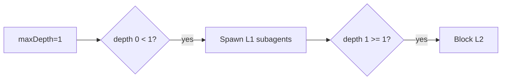

# Agent / Harness Infrastructure Improvements

> **Status:** implementation in progress (2026-07-02). Item 1 ✅ shipped; items 2–5 pending. Per maintainer preference, this proposes **off-the-shelf solutions over bespoke systems** where one exists.

Scope: improving agent *outcomes/performance* and *provider reliability* for the pie stack — the VS Code extension, pi extensions, system prompts, skills, and the umans provider wiring. Four problem areas surfaced from a workspace scan:

1. **Subagent rate-limit storms** — the dominant user-visible pain.
2. **Umans provider strictness** — stricter session limits with no queue / retry backpressure.
3. **Subagent limits being ignored** — the throughput governor that is actually missing.
4. **Prompt / harness hygiene** — instructions that actively encourage fan-out.

---

## 1. Subagent fan-out causes the rate-limit storm

### What's actually happening

The user symptom — *"nesting set to 1 depth max, meaning no nesting, however it keeps happening, resulting in 10+ sub agent calls at once, instantly getting my account rate limited"* — is **not** a depth-enforcement failure. Depth **is** enforced (`extensions/subagent/src/execute.ts`: `if (runtimeCtx.depth >= maxDepth) return depthLimitResponse(...)`). The storm is **horizontal fan-out at one depth level**:

- A model reply can emit **multiple `subagent` tool calls in parallel**. Each tool call then runs its own batch.
- A single `subagent` call can itself fan out via `tasks:[...]` — up to `MAX_PARALLEL_TASKS = 8` tasks, throttled to `MAX_CONCURRENCY = 4` concurrent (`extensions/subagent/src/types.ts`, `modes.ts`).
- Per-reply cap is `MAX_SESSIONS_PER_CALL = 20` (`extensions/subagent/src/helpers.ts`).
- Runner env defaults: `DEFAULT_MAX_DEPTH = 3`, `DEFAULT_MAX_TREE_SESSIONS = 50`.

So under worst-case options the model can fire ~4 concurrent requests in *each* of several parallel tool calls, none of which coordinate with each other. With umans' stricter session limits, that's an instant 429 convoy.

### Why "max depth = 1" didn't help

`subagentMaxDepth` is a **confusingly-labelled "levels allowed"** slider, not a "depth of nesting" slider:



`maxDepth = 1` means "main → L1 is allowed." There is **no `0 = disabled` mode** — the UI clamps to `[1, 8]` (`extension/src/webview/panel/composer/settings-menu-subagent.tsx`) and `validateOptionalInt` in `rpc.ts` clamps to `[1, 8]` too. So "1" never means "no subagents," only "no nesting *below* the first level." That level can still spawn up to 20 sessions per reply.

### Recommendation — concrete code changes

**a. Expose a real "disabled" mode and relabel the slider.**
- Lower `validateOptionalInt` lower bound for `subagentMaxDepth` from `1` → `0` (`extension/src/backend/rpc.ts`).
- Soften the slider `min` to `0` and relabel "Subagent nesting: Off / 1 level / 2 levels…" (`extension/src/webview/panel/composer/settings-menu-subagent.tsx`).
- Short-circuit `execute()` when `maxDepth === 0`: return `disabledErrorResponse(params)` (`extensions/subagent/src/execute.ts`).
- A depth of `0` gives the user the genuine "no nesting / no fan-out" kill switch they were reaching for.

**b. Make the throughput caps configurable and lower the defaults.**
- Promote `MAX_PARALLEL_TASKS`, `MAX_CONCURRENCY`, `MAX_SESSIONS_PER_CALL` from magic constants to `ChatPrefs` (`subagentMaxParallelTasks`, `subagentMaxConcurrency`, `subagentMaxSessionsPerReply`) threaded through the same `runtimePrefs.set` → `PIE_SUBAGENT_*` env mirror that already exists (see `extension/src/backend/request-handler.ts` lines ~95–108).
- Lower default `MAX_PARALLEL_TASKS` 8 → 4 and `MAX_CONCURRENCY` 4 → 2. On umans specifically these should be 2 / 1 (see §2 provider config).
- Add a **global, cross-reply in-flight subagent cap** as a semaphore in the subagent extension. Today `MAX_CONCURRENCY` only throttles within one `tasks[]` array — multiple parallel `subagent` tool calls in one reply do not share a gate. A process-wide `Semaphore(maxInFlight)` wrapping `createAgentSession` is ~15 lines and is the single most effective fix for the "10+ at once" symptom. It is **not** bespoke queue logic — it's the standard concurrency primitive; see §3 for the fuller off-the-shelf option.

---

## 2. Umans provider — proxy for wiring + backpressure

> ### ✅ Implemented (2026-07-02)
> LiteLLM proxy is live in `pie/proxy/`. What shipped:
> - **Scaffold** — `proxy/` (`litellm_config.yaml` with 8 umans model routes, each `litellm_params.max_parallel_requests:4` and a shared `model_info.id: umans-shared` so all variants share one 4-slot queue; `pyproject.toml`; `.env.example`), run via `uv run litellm`.
> - **Control script** — `scripts/proxy.mjs` (`run`/`start`/`stop`/`health`); npm scripts in root `package.json`.
> - **Extension spawn** — `ProxyService` (`extension/src/host/backend/proxy-service.ts`) spawns + health-checks the proxy; `startup.ts` starts it before the backend (fail-loud: NoticeShown, no silent fallback, `UMANS_API_KEY`-present guard). Kill-tree fix (`taskkill /T /F` / process-group kill) prevents the uv→litellm grandchild orphan. The proxy `master_key` is `os.environ/UMANS_API_KEY` so it agrees with pi's auth.json key (LiteLLM is DB-less — a mismatch 400s with "No connected db").
> - **Routing** — `models.json` umans `baseUrl` → `http://localhost:4000/v1`, `apiKey` → `$UMANS_API_KEY` (equals the proxy `master_key`, which is `os.environ/UMANS_API_KEY` — DB-less LiteLLM requires the Authorization to match). Copilot + Ollama stay direct.
> - **Settings** — `pie.useProxy` (default true), `pie.proxyPort` (default 4000).
> - **Verified** — proxy boots, `/health/liveness`→200, real chat completion routed to umans upstream successfully. Extension typecheck + build synced to `~/.vscode/extensions/pie.pie-0.3.0`. *(Remaining: user reloads window to confirm the extension-spawn path.)*
>
> See `proxy/README.md` for operations. Items 2–5 below are still pending.

### Current state

`models.json` defines umans as a passthrough OpenAI-compatible provider:

```json
"umans": {
  "baseUrl": "https://api.code.umans.ai/v1",
  "api": "openai-completions",
  "apiKey": "$UMANS_API_KEY",
  "compat": { "supportsReasoningEffort": true }
}
```

`settings.json` has a top-level `retry` block (`maxRetries: 6`, `baseDelayMs: 3000`, `provider.maxRetryDelayMs: 60000`) — but this is the **pi runtime's own per-request retry**, applied per request in isolation. There is no process-wide admission control: nothing throttles *concurrent* in-flight requests, nothing honours `Retry-After`, nothing queues.

**The therapeutic gap:** when umans 429s one request, the others already in flight keep hammering, each independently retrying with its own backoff — a burst becomes sustained overload and the user is forced to rotate keys.

### Recommendation — use a local LLM gateway proxy (off-the-shelf)

This is the "proxy for wiring up agents with different providers" the maintainer noted is standard practice. The point is to put a single backpressure-aware hop between pie and every provider, rather than building queue/retry logic inside the extension. Two strong, self-hostable, open-source options:

**Option 1 — [LiteLLM Proxy](https://docs.litellm.ai/docs/proxy/quick_start)** *(recommended)*
- One binary / Docker container, OpenAI-compatible endpoint.
- **Per-key / per-model RPM + TPM limits** with a built-in queue and `Retry-After`-aware backoff. LiteLLM is explicitly designed for "many agents hammering one key" — exactly the umans storm.
- Built-in fallback chains (umans primary → openrouter / copilot failover), cost + token + error telemetry, virtual keys for sub-service isolation.
- Routing pie through it is one line in `models.json`:
  ```json
  "umans": { "baseUrl": "http://localhost:4000/v1", "api": "openai-completions", "apiKey": "$UMANS_API_KEY", ... }
  ```
  …plus a `litellm_config.yaml` declaring `umans` as an upstream with `rpm:` / `tpm:` matching the real account limit. Nothing else in pie changes — it already speaks OpenAI-completions.
- Handles the **stricter session limits** the user mentioned: set `rpm:` to just under the quota so a burst queues instead of 429-ing.

**Option 2 — [Portkey Gateway](https://github.com/Portkey-AI/gateway)**
- Same shape (OpenAI-compatible gateway, concurrency controls, retries-with-backoff, `Retry-After` respect, fallbacks).
- The repo already references Portkey price snapshots in `docs/internal/model-token-pricing-sources.md`, so it's a known quantity here.
- Slightly lighter if you only want gateway semantics and don't need LiteLLM's full admin UI / virtual-key system.

**Why a proxy beats building it in pie:** retry/backoff *only* works if it is centralised. Per-request retry in pi, plus per-call concurrency limits in the subagent extension, plus host-level throttling, all reinvent the same wheel at different layers and still don't coordinate across the process boundary. A local gateway is the single chokepoint that makes "rotate API keys" unnecessary: when the limit is hit, requests *queue* and resume as the window slides, instead of 429-ing and failing the agent turn.

**When to skip the proxy:** if you only ever run one pie instance, a single user, one provider, and one model at a time, the in-process semaphore (§1b) is enough. The moment you have subagent fan-out (which is most turns), multi-provider fallback, or want cost telemetry without writing it, LiteLLM wins.

---

## 3. Subagent limits being "ignored" — the missing governor

The phrase in the request — *"the app does not respect sub agent limits … 10+ sub agent calls at once"* — maps precisely to the gap between the two existing limit families:

| Limit | Where enforced | Stops the "10+ at once" storm? |
|---|---|---|
| `subagentMaxDepth` | `extensions/subagent/src/execute.ts` | **No** — caps vertical nesting, not horizontal fan-out |
| `subagentMaxTreeSessions` (50 default) | `runner.ts` `consumeTreeSlot` | **Partly** — total tree budget, but 50 is far too high to prevent a rate-limit |
| `MAX_PARALLEL_TASKS` (8) + `MAX_CONCURRENCY` (4) | `extensions/subagent/src/modes.ts` | **Partly** — but per-call only, hardcoded, and 4-concurrent still bursts umans |
| `MAX_SESSIONS_PER_CALL` (20) | `extensions/subagent/src/helpers.ts` | **No** — too high; also per-call not global |
| *Global in-flight request governor* | **does not exist** | — |

**The missing primitive is a process-wide concurrency gate that the model cannot bypass.** Two ways to land it, in order of effort:

1. **In-process semaphore** (smallest change). Add `extensions/subagent/src/concurrency-limit.ts` exporting a `Semaphore` acquired around every `createAgentSession` call in `runner.ts`. Default `PIE_SUBAGENT_MAX_INFLIGHT=2`. Configurable via the same `runtimePrefs.set` mirror. ~30 lines. This alone kills the 10-at-once symptom.
2. **LiteLLM proxy's `rpm`/`tpm`** (§2). Pushes the guarantee outside pi so it covers the main agent + every subagent + any other pi consumer uniformly — it can't be bypassed even if a future code path forgets the semaphore. **This is the off-the-shelf answer the maintainer asked for.** The in-process semaphore is still worth keeping as defence-in-depth (it fails fast before the request even leaves the machine), but the proxy should be the source of truth for "respect the account limit."

Tighten the obviously-too-high defaults together with whichever path you pick: `DEFAULT_MAX_TREE_SESSIONS` 50 → 10, `MAX_PARALLEL_TASKS` 8 → 4, `MAX_CONCURRENCY` 4 → 2.

---

## 4. Prompt / harness hygiene

### The system prompt actively rewards storms

`APPEND_SYSTEM.md`:
```text
- Delegate to sub-agents when tasks can be broken down into discrete steps ...
  Parallel sub agents are preferred over sequential.
- Always verify your work before completion using a sub agent.
```

Agent configs reinforce it — `agents/worker.md`: "Run independent sub-steps in parallel; sequence them only when one needs another's output." `agents/scout.md`: "fan out to nested scout subagents (parallel) to cover ground faster."

For an unconstrained OpenAI/Claude backend this is the expected, efficient default. Against a rate-limited single-key umans account it is actively self-harming. **The prompt and the limit config are in tension**, and the prompt is winning because the limits were never the right shape (§1, §3).

### Recommendation

- **Replace the blanket "parallel preferred" directive with a conditional one** keyed on provider state. Concretely, add to `APPEND_SYSTEM.md`:
  - Prefer **sequential** subagents unless the tasks are genuinely independent *and* the throughput governor estimates spare capacity.
  - Gate "always verify with a subagent" — for trivial edits it doubles request count for no value; reserve it for non-trivial changes.
- The cleanest implementation is to inject this guidance *dynamically* based on measured umans RPM headroom (the existing `extension/src/host/token-rate-service.ts` already tracks rate; extend it to publish a `providerBusy` signal the prompt builder reads). That keeps the harness adaptive instead of a static prompt that's right on some providers and wrong on others.
- **Audit skills** (`skills/codebase-maintenance`, `skills/diagnose`, `skills/grill-with-docs`, `skills/tdd`) for implicit "run in parallel" directives that compound; they share the same budget.

---

## 5. Centralised settings (cross-cutting)

The `runtimePrefs.set` RPC pattern (`extension/src/backend/request-handler.ts`) already mirrors host prefs → process env for `PIE_SUBAGENT_MAX_DEPTH`, `PIE_SUBAGENT_MAX_TREE_SESSIONS`, `PIE_SUBAGENT_BUCKETS`, `PIE_SUBAGENT_NESTED_ALLOWED_BUCKETS`. Extending it for the new knobs (`PIE_SUBAGENT_MAX_INFLIGHT`, `PIE_SUBAGENT_MAX_CONCURRENCY`, `PIE_SUBAGENT_MAX_PARALLEL_TASKS`) is free — and makes them hot-reload through the settings menu without a reload. Use this same channel for everything in §3 so the user tunes the throttle live while watching the token-rate indicator.

---

## Priority

| # | Change | Effort | Impact on the stated pain | Status |
|---|---|---|---|---|
| 1 | LiteLLM proxy in front of umans, with `rpm` set to the real limit | S–M | **Eliminates** key-rotation. Queue-backoff is the missing governor. | ✅ Done |
| 2 | In-process subagent semaphore (`PIE_SUBAGENT_MAX_INFLIGHT=2`) + expose `MAX_CONCURRENCY` / `MAX_PARALLEL_TASKS` prefs | S | Kills "10+ at once" before a request leaves the machine | ⬜ Pending |
| 3 | `subagentMaxDepth` lower bound 0, relabel slider, short-circuit at 0 | S | Gives the real "no subagents" kill switch | ⬜ Pending |
| 4 | Rewrite the fan-out-biased guidance in `APPEND_SYSTEM.md` + agents adaptively | S | Stops the model from *wanting* the storm | ⬜ Pending |
| 5 | Tighten defaults (`MAX_TREE_SESSIONS` 50→10, `MAX_PARALLEL_TASKS` 8→4, `MAX_CONCURRENCY` 4→2) | XS | Cheap insurance | ⬜ Pending |

Items 1 + 2 together close the loop: the semaphore fails fast locally, LiteLLM holds the queue and retries honouring `Retry-After` centrally. Neither requires bespoke queue logic.

---

## Key file references

| Concern | File |
|---|---|
| Depth gate | `extensions/subagent/src/execute.ts` (`execute()` → `depthLimitResponse`) |
| Extended defaults + runner knobs | `extensions/subagent/runner.ts` (`getMaxDepth`, `getMaxTreeSessions`, `consumeTreeSlot`, `DEFAULT_MAX_*`) |
| Throughput caps (hardcoded) | `extensions/subagent/src/types.ts` (`MAX_PARALLEL_TASKS`, `MAX_CONCURRENCY`), `extensions/subagent/src/helpers.ts` (`MAX_SESSIONS_PER_CALL`) |
| Parallel fan-out wing | `extensions/subagent/src/modes.ts` (`executeParallelMode`, `mapWithConcurrencyLimit`) |
| Pref mirror to env | `extension/src/backend/request-handler.ts` (`handleRuntimePrefsSet`), `extension/src/host/session-service/service.ts`, `extension/src/host/session-service/startup.ts` |
| Prefs shape + defaults | `extension/src/shared/protocol/settings.ts` (`DEFAULT_CHAT_PREFS`), `extension/src/shared/protocol-validation.ts` |
| UI slider + clamps | `extension/src/webview/panel/composer/settings-menu-subagent.tsx`, `extension/src/backend/rpc.ts` (`validateOptionalInt`) |
| Provider wiring | `models.json` (umans block ~line 690), `settings.json` (top-level `retry`) |
| System prompt bias | `APPEND_SYSTEM.md`, `agents/worker.md`, `agents/scout.md` |
| Rate telemetry to extend | `extension/src/host/token-rate-service.ts` |
